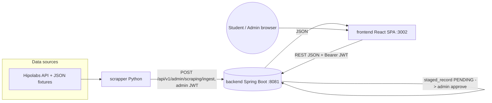
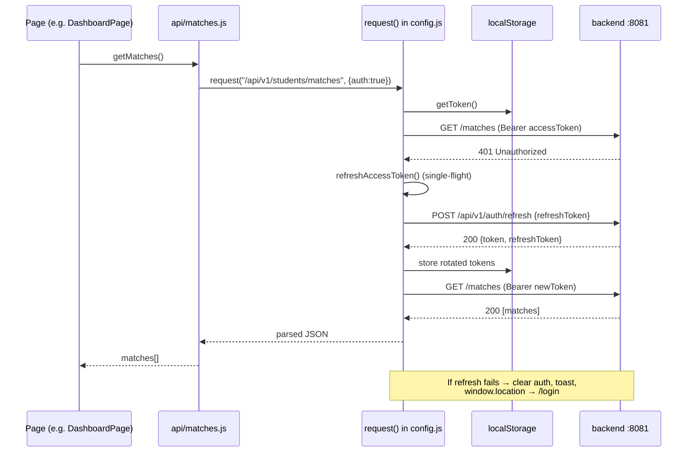

# Frontend (React SPA) — Complete Guide

The **frontend** is the student-facing web application of the Ilmi university-matching
platform: a React 18 single-page app (Create React App) that lets students in Central
Asia search universities, programs, scholarships, jobs and courses, get AI-style match
recommendations, build an academic profile, and track applications. It is a **pure
client** — it owns no data and no business logic; it talks **only** to the backend REST
API (Bearer JWT) and renders what the backend returns.

---

## TL;DR for a newcomer

- **Stack:** React 18.2 + Create React App (`react-scripts` 5.0.1), React Router 6, **CSS
  Modules only** (no inline styles, no Tailwind), Yarn. Dev server is pinned to **port 3002**.
- **One job:** render the UI and call the backend. Every `fetch()` lives in `src/api/`;
  pages never call `fetch` directly. The backend at `http://localhost:8081` is the source
  of truth.
- **Two halves:** [`src/logged-out/`](src/logged-out/) = public marketing + auth pages
  (landing with a Spline 3D hero, login, register, password reset). [`src/logged-in/`](src/logged-in/)
  = the authenticated dashboard app (search, matches, profile, applications, admin).
- **Auth:** JWT access token + refresh token in `localStorage`. [`src/contexts/AuthContext.js`](src/contexts/AuthContext.js)
  holds auth state; [`src/api/config.js`](src/api/config.js) attaches the Bearer header and does a
  **silent single-flight token refresh** on 401, then bounces to `/login` if that fails.
  There is also a **"Continue as guest"** mode (no backend) for demos.
- **i18n:** 5 locales — `en` `ru` `ky` `kk` `tg` ([`src/localization/`](src/localization/)). **Never hardcode
  user-visible text**; use the `t()` function from `useTranslation()`. English is bundled;
  the other 4 are lazy-loaded.
- **Routing:** all real app screens live under `/dashboard/*` behind a `ProtectedRoute`,
  inside a shared `DashboardLayout` (sidebar + topbar). Admin pages add an `AdminRoute`
  (JWT `role === "ADMIN"`).
- **Stale docs warning:** [`README.md`](README.md) and [`TODO.md`](TODO.md) still call the project
  "UniversityMatch" and mention MongoDB/Voiceflow — that is **legacy/aspirational**. The
  real backend is Spring Boot + PostgreSQL. Trust the code and [`ARCHITECTURE.md`](ARCHITECTURE.md), not
  README/TODO.

---

## Tech stack & versions

| Concern | Choice | Version | Notes |
|---|---|---|---|
| UI library | React | `^18.2.0` | `react-dom` 18.2, `React.StrictMode` |
| Tooling | Create React App (`react-scripts`) | `5.0.1` | Not ejected; `eslintConfig: react-app` |
| Routing | `react-router-dom` | `^6.8.0` | `BrowserRouter`, lazy routes |
| Styling | CSS Modules + global tokens | n/a | `*.module.css`; tokens in [`src/styles/variables.css`](src/styles/variables.css) |
| 3D hero | `@splinetool/react-spline` + `runtime` | `^4.1.0` / `^1.12.67` | Landing-page robot scene |
| Toasts | `react-hot-toast` | `^2.6.0` | Mounted once in [`src/App.js`](src/App.js) |
| Charts | `chart.js` | `^4.5.1` | Used by dashboard/analytics widgets |
| Animation | `framer-motion` | `^10.0.0` | |
| Particles | `@tsparticles/*` | `^3.x` | Landing sparkles |
| Scrollbars | `overlayscrollbars(-react)` | `^2.x` / `^0.5.6` | Custom scroll panels (`ScrollContainer`) |
| Error monitoring | `@sentry/react` | `^10.56.0` | No-op unless `REACT_APP_SENTRY_DSN` set |
| Icons / QR | `react-icons`, `react-qr-code` | `^4.7.0` / `^2.0.18` | |
| Package manager | Yarn | `1.22.22` | `packageManager` field pins it |
| Lint / format | ESLint 8 / Prettier 2 | | `yarn lint`, `yarn format` |
| Node runtime | Node + Yarn | (CRA 5 → Node 14+) | |

`package.json` scripts: `start` (`PORT=3002 react-scripts start`), `build`, `test`,
`eject`, `lint` (`eslint src/`), `format` (`prettier --write src/`).

---

## How it fits the whole system

The frontend is the last hop in the data flow. Catalog data is ingested by the **scrapper**
into a backend **staging** area, an admin approves it into live tables, and the frontend
reads/writes the live data over REST with a Bearer JWT. The frontend never touches the
database or the scrapper directly.



ASCII fallback:

```
 Hipolabs + fixtures
        |
        v
   [ scrapper ]  --POST /api/v1/admin/scraping/ingest (admin JWT)-->  [ backend :8081 ]
                                                                       staged_record
                                                                       PENDING --approve--> live tables
                                                                            ^   |
   Student/Admin browser --> [ frontend :3002 ] --REST JSON + Bearer JWT----+   |
                                     ^------------------------ JSON --------------+
```

**This document is about the rightmost box — the frontend.** Its only external dependency
is the backend base URL (`REACT_APP_API_URL`, default `http://localhost:8081`).

---

## Directory / module map

Tree of the meaningful files under [`src/`](src/) (node_modules / build omitted):

```
frontend/
├── package.json                      Scripts + deps; pins PORT=3002 and Yarn
├── .env / .env.default / .env.production   REACT_APP_API_URL + dev-server flags
├── Dockerfile · nginx.conf · docker-compose.yml   Prod build (static → nginx)
├── ARCHITECTURE.md                   Accurate architecture notes (read this)
├── README.md · TODO.md               LEGACY "UniversityMatch" docs — partly stale
├── DEPLOYMENT.md · PROJECT_DOCUMENTATION.md · HERO_SPLINE_FIX_PROMPT.md
└── src/
    ├── index.js                      Entry: theme bootstrap, Sentry init, render <App/>
    ├── App.js                        Router + route table + Auth/Public/Admin guards
    ├── contexts/
    │   └── AuthContext.js             Auth state, login/register/logout/guest, role gating
    ├── api/                           THE ONLY place fetch() lives — one module per resource
    │   ├── config.js                 request() wrapper: base URL, Bearer header, 401 refresh
    │   ├── auth.js                    login / register / logout / password-reset
    │   ├── universities.js · programs.js · scholarships.js · jobs.js · courses.js
    │   ├── fields.js                  University-field enum (client-side; no backend route)
    │   ├── favorites.js · interests.js · funding.js · academics.js · studentProfile.js
    │   ├── applications.js            Applications + per-application tasks (checklist)
    │   ├── matches.js                 University match list
    │   ├── essays.js                  Essay-review availability + submit
    │   ├── countries.js · admin.js    Country list; admin staging review + CSV ingest
    │   └── index.js                   Re-exports a subset
    ├── hooks/
    │   ├── useLanguage.js             i18n hook: useLanguage / useTranslation / translate()
    │   └── useDebounce.js             Search debouncing
    ├── lib/                           Framework-agnostic helpers
    │   ├── errorMonitor.js            Sentry init wrapper (no-op without DSN)
    │   ├── formatEnum.js · safeUrl.js · utils.js · ilmiLogoUrl.js · ilmiContact.js
    ├── localization/                  i18n dictionaries
    │   ├── en.js (~1407 lines, bundled)  ru.js (~1400)  ky.js · kk.js · tg.js (~295 each)
    │   ├── index.js                   Lazy import() map for the 4 non-English locales
    │   └── translate.js               Inline [en]..[/en][ru]..[/ru] tag parser (data strings)
    ├── styles/
    │   ├── variables.css              Design tokens (fonts, sizes, spacing, light/dark palette)
    │   ├── core.css                   Reset + base; @imports variables.css
    │   └── animations.css             Keyframes
    ├── components/                    Cross-app components
    │   ├── ErrorBoundary.js           Top-level React error boundary
    │   ├── LanguageSwitcher/          5-locale dropdown
    │   ├── SplineScene/               Lazy-loaded 3D hero (Spline)
    │   ├── Spotlight/ · OnboardingBanner/ · IlmiContactHub/
    │   └── ui/                        ScrollContainer, SkyToggle (theme), LandingSparklesHeader, sparkles
    ├── ui-components/                 Form primitive kit (index.js re-exports all)
    │   └── SearchField · SelectField · NumberField · FilterChip · TextLinkButton · AccentButton
    ├── logged-out/                    PUBLIC app (no auth)
    │   ├── pages/PublicHomePage/      Landing: nav, Spline hero, Features, About, FAQ, Contact, Footer
    │   ├── pages/LoginPage/ · RegisterPage/
    │   └── pages/ForgotPasswordPage/ · ResetPasswordPage/ · VerifyEmailPage/
    │       components/landing/Features/
    └── logged-in/                     AUTHENTICATED app
        ├── shared/
        │   ├── DashboardLayout/       Sidebar (NAV_GROUPS) + topbar shell for all /dashboard/*
        │   ├── PageTemplate/ · ContentPage/ · NotFoundPage/ · Icons/
        └── pages/
            ├── MainPages/             Dashboard, SearchUniversities (+UniversityDetail, FavoriteUniversities),
            │                          SearchFields (+FieldDetail), SearchPrograms (+ProgramDetail,
            │                          FavoritePrograms), SearchScholarships, Jobs, Courses,
            │                          Profile (+Interests/Funding sections), MyAcademics, SendInfo,
            │                          DreamUniversity, StudyTogether, UniversityReels
            ├── AIMatchingPages/       MatchUniversities, MatchScholarships, SimilarStudents
            ├── ApplicationPages/      MyApplications (+ChecklistSection), ApplicationTimeline, MyDocuments
            ├── LearningPages/         EssayReview (live), EssayWriting, English, Math, GetCourses, AILiteracy
            ├── CareerPages/ · CommunityPages/ · PremiumPages/ · ContactPages/ · PrivacyPages/
            └── AdminPages/AdminReviewPage/   Staging review (approve/reject) + CSV ingest
```

> Note: many pages under `LearningPages`, `CareerPages`, `CommunityPages`, `PremiumPages`,
> `PrivacyPages`, plus `DreamUniversity`/`StudyTogether`/`UniversityReels`, exist in the
> tree but are **not wired into the router** in [`src/App.js`](src/App.js) — they are built-but-unrouted
> screens. The live routes are the authoritative list (see Public surface).

---

## Internal architecture

Layers, top to bottom:

1. **Entry / bootstrap** ([`src/index.js`](src/index.js)) — applies the saved theme (`light`/`dark`,
   default dark) to `<body theme="...">` before first paint, initializes Sentry (no-op
   without a DSN), and renders `<App/>` in StrictMode.
2. **App shell** ([`src/App.js`](src/App.js)) — wraps everything in `AuthProvider` → `ErrorBoundary` →
   `Toaster` → `Router`. All route components are `React.lazy`-loaded (code-split per
   navigation). Defines three guards:
   - `PublicRoute` — if authenticated, redirect to `/dashboard`.
   - `ProtectedRoute` — if not authenticated, redirect to `/`.
   - `AdminRoute` — must be authenticated **and** `isAdmin` (JWT `role === "ADMIN"`), else `/dashboard`.
3. **Auth context** ([`src/contexts/AuthContext.js`](src/contexts/AuthContext.js)) — single source of UI auth state.
   On mount it reads `localStorage`, decodes JWT claims **without verifying** (UI gating only;
   the backend enforces), and optimistically validates the token by calling
   `getStudentProfile()` (a 401 there triggers a clean logout via the shared handler).
4. **API layer** ([`src/api/`](src/api/)) — `request()` in [`config.js`](src/api/config.js) is the choke point: builds the
   URL + query string, injects `Authorization: Bearer <token>` when `auth:true`, parses
   JSON, and centralizes error handling (global toast for 5xx/network; inline for domain 4xx).
5. **Pages** ([`src/logged-in/`](src/logged-in/), [`src/logged-out/`](src/logged-out/)) — call the resource modules, hold
   local state, render via CSS Modules, and translate every string with `t()`.

**Representative path — an authenticated GET that hits an expired token:**



ASCII fallback:

```
Page → api/matches.js → request() → [Bearer token] → backend GET /matches
                                                          └─ 401? ──► POST /auth/refresh {refreshToken}
                                                                         ├─ ok  → store rotated tokens → retry GET → 200 → JSON → Page
                                                                         └─ fail→ clear localStorage → toast → redirect /login
        (network error → global toast "server unreachable" + throw)
        (5xx → global toast; 4xx domain error → thrown for the page to show inline)
```

Key resilience details in [`config.js`](src/api/config.js):
- **Single-flight refresh** (`refreshInFlight`): concurrent 401s share one `/auth/refresh`
  call instead of stampeding the endpoint.
- **204 / empty body** → returns `null`; non-JSON success body → returns raw text.
- **Redirect-loop guard**: `handleSessionExpired()` is a no-op when already on `/login` or `/register`.

---

## Key concepts & domain model

| Concept | What it is | Where |
|---|---|---|
| **AuthContext / `useAuth()`** | `{ isAuthenticated, isLoading, user, isAdmin, login, register, logout, loginAsGuest }`. `user = { email, name, role, isGuest }`. | [`contexts/AuthContext.js`](src/contexts/AuthContext.js) |
| **localStorage auth keys** | `token` (access JWT), `refreshToken`, `userEmail`, `userName`, `authGuest` (`"true"`). Also `theme`, `preferred-language`. | `AuthContext.js` + `config.js` |
| **Guest mode** | "Continue as guest" sets `authGuest=true`, no backend; `GUEST_USER = guest@ilmi.demo`. Lets users explore the UI offline. | `AuthContext.js` |
| **Role gating** | `decodeRole(token)` reads the JWT `role` claim (UI only). `ADMIN` unlocks the admin nav group + `/dashboard/admin`. | `AuthContext.js`, `App.js`, `DashboardLayout` |
| **`request()` options** | `{ method, auth, body, query, errorMessage }`. `query` arrays append repeated params; null/""/undefined are skipped. | [`api/config.js`](src/api/config.js) |
| **i18n `t()`** | `const { t } = useTranslation(); t("heroTitleLine2")`. Missing key → returns the key. English bundled; ru/ky/kk/tg lazy-loaded. | [`hooks/useLanguage.js`](src/hooks/useLanguage.js) |
| **`translate(s, lang)`** | Separate parser for **inline-tagged data strings** like `[en]Hello[/en][ru]Привет[/ru]` (used for backend-provided multilingual text). Different from the key-based `t()`. | [`localization/translate.js`](src/localization/translate.js) |
| **Design tokens** | CSS custom properties (fonts `--font-display/body`, sizes, spacing, light/dark palette). Components consume them; legacy aliases (`--ownGreen`, etc.) are remapped for compatibility. | [`styles/variables.css`](src/styles/variables.css) |
| **Theme** | `light`/`dark` on `<body theme>` + `<html>` class; toggled by `SkyToggle`, persisted in `localStorage.theme`, broadcast via a `themeChanged` CustomEvent. Default **dark**. | `index.js`, `DashboardLayout`, `PublicHomePage` |
| **DashboardLayout** | Sidebar nav driven by `NAV_GROUPS` (main / opportunities / aiTools / apply) + conditional `ADMIN_GROUP`; topbar with language switcher, theme toggle, deadline-reminder bell, profile. Renders `<Outlet/>`. | [`logged-in/shared/DashboardLayout/index.js`](src/logged-in/shared/DashboardLayout/index.js) |
| **ScrollContainer** | The document never scrolls (`html{overflow:hidden}`); each screen scrolls inside an `overlayscrollbars` panel. | `components/ui/ScrollContainer` |
| **Domain entities (read from backend)** | universities, programs, fields (enum), scholarships, jobs, courses, applications (+tasks), favorites, transcripts, exams, funding sources, interested degrees/fields, staged_record. | `src/api/*` |

---

## Public surface / contract

This is a frontend, so its "contract" is **(1) the route table** and **(2) which backend
endpoints each screen calls**. All backend paths are under base `http://localhost:8081`
(`REACT_APP_API_URL`). `auth` = sends `Authorization: Bearer <jwt>`.

### Route table (from [`src/App.js`](src/App.js))

| Path | Guard | Component | Backend endpoints it calls |
|---|---|---|---|
| `/` | Public (→`/dashboard` if logged in) | PublicHomePage (landing) | none (contact form is local-only) |
| `/login` | Public | LoginPage | `POST /api/v1/auth/login` |
| `/register` | Public | RegisterPage | `POST /api/v1/auth/register`, `GET /api/v1/countries` |
| `/forgot-password` | Public | ForgotPasswordPage | `POST /api/v1/auth/password-reset/request` |
| `/reset-password` | open (email link) | ResetPasswordPage | `POST /api/v1/auth/password-reset/confirm` |
| `/verify-email` | open (email link) | VerifyEmailPage | (email verification) |
| `/dashboard` | Protected | DashboardPage (index) | `GET /universities`, `GET /students/matches`, `GET /students/scholarship-matches`, `GET /students/applications` |
| `/dashboard/search/universities` | Protected | SearchUniversitiesPage | `GET /api/v1/universities` |
| `/dashboard/search/universities/:slug` | Protected | UniversityDetailPage | `GET /api/v1/universities/:id`, favorites |
| `/dashboard/search/universities/favorites` | Protected | FavoriteUniversitiesPage | `GET/POST/DELETE /students/favorite-universities` |
| `/dashboard/search/fields` | Protected | SearchFieldsPage | field enum (client-side) |
| `/dashboard/search/fields/:slug` | Protected | FieldSlugRouter → FieldDetail | `GET /api/v1/universities` (filtered) |
| `/dashboard/search/programs` | Protected | SearchProgramsPage | `GET /api/v1/programs` |
| `/dashboard/search/programs/:id` | Protected | ProgramDetailPage | `GET /api/v1/programs/:id` |
| `/dashboard/search/programs/favorites` | Protected | FavoriteProgramsPage | `GET/POST/DELETE /students/favorite-programs` |
| `/dashboard/search/scholarships` | Protected | SearchScholarshipsPage | `GET /api/v1/scholarships` |
| `/dashboard/opportunities/jobs` | Protected | JobsPage | `GET /api/v1/jobs` |
| `/dashboard/opportunities/courses` | Protected | CoursesPage | `GET /api/v1/courses` |
| `/dashboard/ai/match-universities` | Protected | MatchUniversitiesPage | `GET /students/matches`, `POST /students/transcripts`, `POST /students/exams`, applications |
| `/dashboard/ai/match-scholarships` | Protected | MatchScholarshipsPage | `GET /students/scholarship-matches` |
| `/dashboard/learning/essay-review` | Protected | EssayReviewPage | `GET /students/essays/availability`, `POST /students/essays/review` |
| `/dashboard/academics` | Protected | MyAcademicsPage | transcripts + exams CRUD |
| `/dashboard/applications` | Protected | MyApplicationsPage | applications + tasks CRUD |
| `/dashboard/profile` | Protected | ProfilePage | profile, interests, funding |
| `/dashboard/send-info` | Protected | SendInfoPage | (contact / info form) |
| `/dashboard/admin` | **Admin** | AdminReviewPage | staging review + CSV ingest |
| `/dashboard/*` | Protected | NotFoundPage | — |
| `*` | open | NotFoundPage | — |

### Backend endpoints consumed (grouped, from `src/api/*`)

**Auth** ([`auth.js`](src/api/auth.js))
| Method | Path | Auth | Purpose |
|---|---|---|---|
| POST | `/api/v1/auth/login` | no | Login → `{token, refreshToken, email, name, ...}` |
| POST | `/api/v1/auth/register` | no | Register student |
| POST | `/api/v1/auth/refresh` | no (refresh token) | Rotate access token (silent, in `config.js`) |
| POST | `/api/v1/auth/logout` | yes | Server-side revoke (fire-and-forget) |
| POST | `/api/v1/auth/password-reset/request` | no | Email a reset link |
| POST | `/api/v1/auth/password-reset/confirm` | no | Set new password via token |

**Catalog** (read-only browse)
| Method | Path | Auth | Module |
|---|---|---|---|
| GET | `/api/v1/universities` , `/universities/:id` | no | [`universities.js`](src/api/universities.js) |
| POST | `/api/v1/universities` | yes | create (admin/seed) |
| GET | `/api/v1/programs` , `/programs/:id` | no | [`programs.js`](src/api/programs.js) |
| GET | `/api/v1/scholarships` | no | [`scholarships.js`](src/api/scholarships.js) |
| GET | `/api/v1/jobs` | no | [`jobs.js`](src/api/jobs.js) |
| GET | `/api/v1/courses` | no | [`courses.js`](src/api/courses.js) |
| GET | `/api/v1/countries` | no | [`countries.js`](src/api/countries.js) |

**Student profile & academics** (all `auth`)
| Method | Path | Purpose | Module |
|---|---|---|---|
| GET / PUT | `/api/v1/students/me/profile` | Read / update profile | [`studentProfile.js`](src/api/studentProfile.js) |
| GET/POST/DELETE | `/api/v1/students/transcripts` (`/:id`) | Transcripts | [`academics.js`](src/api/academics.js) |
| GET/POST/DELETE | `/api/v1/students/exams` (`/:id`) | Standardized exams | [`academics.js`](src/api/academics.js) |
| GET/POST/DELETE | `/api/v1/students/funding-sources` (`/:id`) | Funding | [`funding.js`](src/api/funding.js) |
| GET/POST/DELETE | `/api/v1/students/interested-degrees` (`/:id`) | Interests | [`interests.js`](src/api/interests.js) |
| GET/POST/DELETE | `/api/v1/students/interested-fields` (`/:id`) | Interests | [`interests.js`](src/api/interests.js) |

**Matching & essays** (all `auth`)
| Method | Path | Purpose | Module |
|---|---|---|---|
| GET | `/api/v1/students/matches` | University match list | [`matches.js`](src/api/matches.js) |
| GET | `/api/v1/students/scholarship-matches` (`?eligibleOnly`) | Scholarship matches | [`scholarships.js`](src/api/scholarships.js) |
| GET | `/api/v1/students/essays/availability` | Essay-review quota | [`essays.js`](src/api/essays.js) |
| POST | `/api/v1/students/essays/review` | Submit essay for review | [`essays.js`](src/api/essays.js) |

**Favorites** (all `auth`)
| Method | Path | Module |
|---|---|---|
| GET/POST/DELETE | `/api/v1/students/favorite-universities` (`/:id`) | [`favorites.js`](src/api/favorites.js) |
| GET/POST/DELETE | `/api/v1/students/favorite-programs` (`/:id`) | [`programs.js`](src/api/programs.js) |

**Applications & tasks** (all `auth`) ([`applications.js`](src/api/applications.js))
| Method | Path | Purpose |
|---|---|---|
| GET/POST | `/api/v1/students/applications` | List / create application |
| PUT/DELETE | `/api/v1/students/applications/:id` | Update / delete |
| GET/POST | `/api/v1/students/applications/:id/tasks` | Checklist tasks |
| PUT/DELETE | `/api/v1/students/applications/:id/tasks/:taskId` | Update / delete task |

**Admin scraping / approval** (all `auth`, ADMIN role) ([`admin.js`](src/api/admin.js))
| Method | Path | Purpose |
|---|---|---|
| GET | `/api/v1/admin/scraping` (`?type&status`) | List staged records |
| POST | `/api/v1/admin/scraping/:id/approve` | Approve into live tables |
| POST | `/api/v1/admin/scraping/:id/reject` | Reject |
| POST | `/api/v1/admin/scraping/ingest-csv` | Upload a CSV (multipart) into staging |

> The doc comment in [`src/api/index.js`](src/api/index.js) (and the example in [`config.js`](src/api/config.js)'s
> `apiUrl` JSDoc) still mention the old default `http://localhost:8082`; the real code default in
> [`config.js`](src/api/config.js) is `http://localhost:8081`.

---

## How to run & verify locally

**Prereqs (macOS):** Node + Yarn; the backend running at `http://localhost:8081`
(see the workspace [CLAUDE.md](../CLAUDE.md) / `backend/run-local.sh`) for real login/data. Without the
backend you can still use **"Continue as guest"**.

```bash
cd /Users/agentsinc/Desktop/ilmi/frontend
cp .env.default .env          # then set REACT_APP_API_URL=http://localhost:8081
#                              (.env.default ships 8082 — change it to 8081 for local backend)
yarn install
yarn start                    # → http://localhost:3002  (PORT is pinned in package.json)
```

Other commands:

```bash
yarn build      # production bundle → build/  (uses .env.production REACT_APP_API_URL)
yarn test       # CRA / Jest unit tests (e.g. config.test.js, programs.test.js, useDebounce.test.js, safeUrl.test.js)
yarn lint       # eslint src/
yarn format     # prettier --write src/
```

**Production build** is a static bundle served by **nginx** (see [`Dockerfile`](Dockerfile),
[`nginx.conf`](nginx.conf)); `.env.production` points the API at the Cloud Run URL
`https://ilmi-960325604158.europe-west1.run.app`.

**VERIFIED WORKING (2026-06-22):**
- Frontend `:3002` — **"Compiled successfully!"**, serves **HTTP 200**; landing page renders
  (hero **"Guidance for your study journey"**, Spline 3D robot, language switcher
  en/ru/ky/kk/tg). Only benign React-Router-v7 future-flag console warnings.
- Backend `:8081` — `GET /actuator/health` → 200 `{"status":"UP"}`; admin login
  `POST /api/v1/auth/login` returns `{token, refreshToken, email, firstName, lastName, name}`.
  Admin bootstrap account: `admin@ilmi.dev` / `admin12345`.
- Data available for the UI to render: universities=16, program=10, job=6, course=6,
  internal_scholarships=6; staged_record PENDING=9 (visible in the admin review page).

Expected first-run signals: CRA prints "Compiled successfully!" and serves on
`http://localhost:3002`; visiting `/` shows the dark landing page; logging in (or
"Continue as guest") lands you on `/dashboard` inside the sidebar layout.

---

## Gotchas & non-obvious things

- **README/TODO are stale.** [`README.md`](README.md) + [`TODO.md`](TODO.md) describe a legacy
  "UniversityMatch" with MongoDB/Voiceflow and list many routes that **don't exist** in
  [`src/App.js`](src/App.js). Trust [`ARCHITECTURE.md`](ARCHITECTURE.md) and the code. The router in `App.js` is the
  authoritative route list; many `LearningPages`/`CareerPages`/`PremiumPages`/etc. are
  built-but-unrouted.
- **`.env.default` ships `REACT_APP_API_URL=http://localhost:8082`** but the running
  backend is **:8081** and `config.js`'s fallback is **:8081**. Set `.env` to 8081 locally.
- **CSS Modules only.** No inline `style={{...}}`, no Tailwind. Use `styles.foo` from a
  co-located `*.module.css` and reuse tokens from [`styles/variables.css`](src/styles/variables.css). (Two pages
  inject a tiny global `<style>` to force `overflow:hidden` for full-bleed scroll — that's
  intentional layout plumbing, not a styling pattern to copy.)
- **5-locale rule.** Every user-visible string must be a `t("key")` lookup added to **all
  five** locale files (`en/ru/ky/kk/tg`). `en.js` and `ru.js` are full (~1400 keys); `ky/kk/tg`
  are smaller (~295) — missing keys silently fall back to the key string, so keep them in sync.
- **`fetch` only in `src/api/`.** Pages must call the resource modules, never `fetch`
  directly — that's how the Bearer header, refresh, and error toasts stay centralized.
- **JWT is decoded, not verified, on the client.** `decodeRole`/`isTokenExpired` are **UI
  gating only**; the backend is the real authority. Never trust client role checks for security.
- **Silent refresh + redirect on 401.** An expired access token triggers one `/auth/refresh`
  (single-flight). If that fails, the session is cleared and the app hard-navigates to
  `/login` via `window.location.assign` — a deliberate full reset, not a SPA route change.
- **Guest mode hits no backend.** With `authGuest=true`, authenticated calls will fail
  (no token); guard guest paths or expect empty data (e.g. `DashboardLayout` skips the
  deadline fetch for guests).
- **Theme is applied pre-paint** in [`index.js`](src/index.js) to avoid a flash; toggling broadcasts a
  `themeChanged` CustomEvent that layout components listen for.
- **Document doesn't scroll.** `html{overflow:hidden}` in [`core.css`](src/styles/core.css); scrolling happens
  inside `ScrollContainer` (overlayscrollbars). New full-page screens should use it.
- **Backend writes go to staging, not live.** The admin page approves `staged_record`s; the
  scrapper never writes live tables (this is a backend/scrapper rule but explains why the
  admin review page exists in the frontend).

---

## ✅ What we have today (current state — code-verified)

Confirmed in this repo's code on `master`. Status: ✅ shipped · 🟡 partial/fallback-only.

| Capability | Status | Evidence (file) |
|---|---|---|
| React 18 + CRA, **CSS Modules only** (sole exception: dynamic `--fill` custom-property for progress bars) | ✅ | [package.json](package.json), `*.module.css` |
| 23 routes with Public / Protected / Admin guards | ✅ | [src/App.js](src/App.js) |
| `logged-in/` (auth app) vs `logged-out/` (public marketing) split | ✅ | [src/logged-in](src/logged-in), [src/logged-out](src/logged-out) |
| AuthContext: JWT decode + role, **single-flight silent refresh on 401**, guest mode (`guest@ilmi.demo`), token re-validated against server on mount | ✅ | [src/contexts/AuthContext.js](src/contexts/AuthContext.js), [src/api/config.js](src/api/config.js) |
| i18n **en/ru full** (~1400 keys) + **ky/kk/tg via Russian fallback** (~295 keys, lazy-loaded) | 🟡 ky/kk/tg incomplete | [src/localization](src/localization) |
| Code-split bundle, Sentry env-gated, ErrorBoundary + 404 + localized error toasts | ✅ | `src/index.js`, `config.js` |
| Search pages with `useDebounce` + stale-response guards | ✅ | `src/hooks/useDebounce`, search pages |
| `isSafeHttpUrl` gate on all external links (blocks `javascript:`/`data:`/open-redirect) | ✅ | `src/utils`, `safeUrl.test.js` |
| Apply-through UI: MyApplications + expandable checklist w/ progress + onboarding banner | ✅ | `src/logged-in` |
| My Academics (view/delete transcripts + exams) | ✅ | `src/logged-in` |
| Dashboard de-faked (real status donut + real teaser counts) | ✅ | `DashboardPage` |
| Scholarship-matches page; status dropdown limited to backend-allowed transitions | ✅ | `MatchScholarships`, applications |
| ~15 frontend tests | ✅ | `src/**/*.test.js` |

## 🔜 What we must have (ideal future / roadmap)

Open items from [rules/NEXT-STEPS.md](../rules/NEXT-STEPS.md).

| Gap / wanted capability | Why it matters | Priority | Effort | Where |
|---|---|---|---|---|
| **Native kk/ky/tg translations** (~730 keys × 3 langs) | non-Russian-reading CA users currently see Russian fallback | P2 | L (needs human translation) | [src/localization](src/localization) |
| **Server-side search + pagination UI** for universities/programs | these still load the full/capped set and filter client-side (Jobs/Scholarships already have Load-more) | **P0** | L | `src/api/{universities,programs}.js`, search pages |
| Unify `frontend/.env.default` `REACT_APP_API_URL` **:8082 → :8081** + fix 2 stale code comments | a newcomer copying `.env.default` points the app at the wrong port | S | S | [.env.default](.env.default), `src/api/config.js`, `src/api/index.js` (⚠️ `.env.default` is AGENTS-protected — change only on explicit request) |
| Wire-in **or** formally remove built-but-unrouted pages (LearningPages bar essay-review, Career/Community/Premium/Privacy, DreamUniversity, StudyTogether, UniversityReels) | dead components read as "features" | clarity | M | `src/logged-in`, `src/App.js` |
| Broader **tests** (AuthContext, protected-route redirect, search rendering) | only ~15 today | L | L | `src/**` |
| Mobile/responsive audit | mobile-first CA audience | UX | M | layout/styles |
| Confirm-dialog + toast on destructive deletes (transcript/exam/funding/application/favorite) | accidental data loss | P2 | S | delete handlers |

> **Owner-excluded (intentional):** Stripe/premium pages (cut), external email/Telegram notifications (in-app reminders only). Staying on **Create-React-App** (no Next.js migration) is a locked decision.

---

## Where to go next

In-repo docs:
- [`ARCHITECTURE.md`](ARCHITECTURE.md) — accurate folder + layer overview (the best companion to this file).
- [`DEPLOYMENT.md`](DEPLOYMENT.md) — production build, Docker, nginx, Cloud Run target.
- [`PROJECT_DOCUMENTATION.md`](PROJECT_DOCUMENTATION.md) — broader project notes.
- [`HERO_SPLINE_FIX_PROMPT.md`](HERO_SPLINE_FIX_PROMPT.md) — context for the Spline 3D hero.
- [`README.md`](README.md) / [`TODO.md`](TODO.md) — **legacy**, read with skepticism.
- Key code entry points: [`src/App.js`](src/App.js), [`src/api/config.js`](src/api/config.js),
  [`src/contexts/AuthContext.js`](src/contexts/AuthContext.js), [`src/hooks/useLanguage.js`](src/hooks/useLanguage.js),
  [`src/logged-in/shared/DashboardLayout/index.js`](src/logged-in/shared/DashboardLayout/index.js).

Sibling repos (independent git repos in the workspace):
- **backend/** — `ilmiOrg/backend` (Java 21 · Spring Boot 3 · PostgreSQL). Owns the DB,
  auth, matching, catalog, and the `/api/v1/*` endpoints this app calls.
- **scrapper/** — `ilmiOrg/scrapper` (Python). Ingests catalog data into backend staging.
- **rules/** — `ilmiOrg/rules` (Markdown). Working agreements; read `rules/AGENTS.md` before
  changing code (strict equality, CSS-modules-only, 5-locale rule, `git add` specific paths).
- Workspace overview: [`../CLAUDE.md`](../CLAUDE.md).
